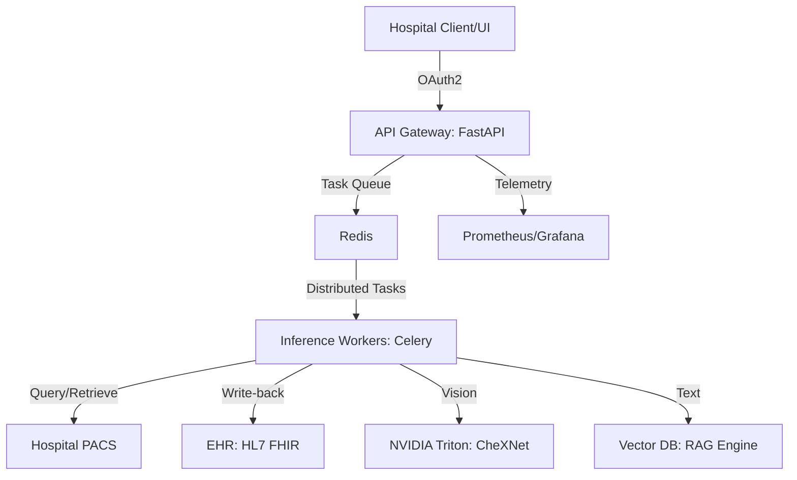

<div align="center">
# 🏥 Clinica-LENS
**Longitudinal Explainable Network System for Multi-modal Clinical Diagnostics**

[](https://www.python.org/downloads/)
[](https://pytorch.org/)
[](https://fastapi.tiangolo.com/)
[](https://www.docker.com/)
[](https://kubernetes.io/)
[](https://opensource.org/licenses/MIT)

[](https://github.com/dhruvin0041/Clinica-LENS)
[_Ready-success.svg?style=for-the-badge)](https://github.com/dhruvin0041/Clinica-LENS)
[](https://github.com/dhruvin0041/Clinica-LENS)

[Overview](#-overview) • [Core Capabilities](#-core-capabilities) • [Architecture](#-architecture) • [Medical Pipeline](#-medical-pipeline) • [Infrastructure](#-infrastructure) • [Regulatory](#-regulatory)

</div>

---

## 🌟 Overview

**Clinica-LENS** is an enterprise-grade diagnostic platform designed for complex hospital environments. It integrates vision, text, and longitudinal patient data to provide explainable, high-fidelity clinical insights. Built as a **Software as a Medical Device (SaMD)**, it unifies state-of-the-art AI with active medical infrastructure (PACS, FHIR) to support professional radiological workflows.

---

## 💎 Core Capabilities

### 🧠 Advanced Multi-modal AI
- **Vision Encoding:** DenseNet121-based **CheXNet** backbone for high-resolution medical image feature extraction.
- **Text Understanding:** **SapBERT** integration for processing dense clinical notes and medical terminology.
- **Transformer Fusion:** Cross-attention mechanisms that enable deep interaction between visual findings and patient history.
- **Temporal Analysis:** Siamese-based longitudinal scoring to track disease progression over time (Current vs. Prior studies).

### 🔍 Deep Explainability (XAI)
- **Spatial Localization:** Grad-CAM heatmaps for high-attribution feature region identification.
- **Counterfactual Reasoning:** Inpainting-based "What-If" analysis to quantify the diagnostic impact of specific visual regions.
- **Clinical Calibration:** **Platt Scaling** and **Conformal Prediction** ensuring confidence scores are statistically aligned with real-world clinical probabilities.

### 🔗 Active Medical Interoperability
- **PACS Client (SCU):** Integrated DICOM engine supporting **C-FIND** and **C-MOVE** for automated retrieval of historical patient studies.
- **DICOMweb Support:** Native WADO-RS and QIDO-RS compatibility for cloud-native imaging.
- **FHIR Synchronization:** Active write-back of AI-generated `DiagnosticReport` resources to hospital EHRs.

---

## 🏗 Architecture

Clinica-LENS follows a **Distributed Clinical Mesh** architecture, ensuring high availability and multi-tenant isolation.



---

## 🔬 Medical Pipeline

### 1. Pre-processing & Windowing
The pipeline supports high-bit depth DICOM images with dynamic windowing (Window Center/Width) to preserve clinical detail in soft tissue or lung parenchyma.

### 2. Inference & Uncertainty
Uses **MC Dropout** for epistemic uncertainty estimation, providing clinicians with a variance score along with the primary diagnosis.

### 3. Verification & RAG
Integrates a **Medical RAG (Retrieval-Augmented Generation)** system to verify findings against established medical literature, generating structured radiology reports (Findings & Impression).

---

## 📋 Regulatory Documentation

The platform includes a comprehensive framework for global compliance:
- **CER (Clinical Evaluation Report):** Automated mapping of AI performance to clinical standards.
- **Risk Management (ISO 14971):** Integrated hazard analysis and mitigation tracking.
- **Technical File:** Full architectural and safety documentation for **FDA 510(k)** and **CE-MDR** submissions.

---

## 🚦 Getting Started

### Launch the Distributed Stack
```bash
docker-compose up --build
```

### Infrastructure Components
*   **UI Dashboard:** `http://localhost:8501` (Streamlit High-Fidelity Dashboard)
*   **Enterprise API:** `http://localhost:8000` (FastAPI with OpenAPI/Swagger docs)
*   **PACS Listener:** `localhost:11112` (DICOM SCP)
*   **Monitoring:** `http://localhost:8000/metrics` (Prometheus Metrics)

---

<div align="center">

**Advancing Clinical Diagnostics through Explainable Intelligence.**  
Developed by [dhruvin0041](https://github.com/dhruvin0041)

</div>
