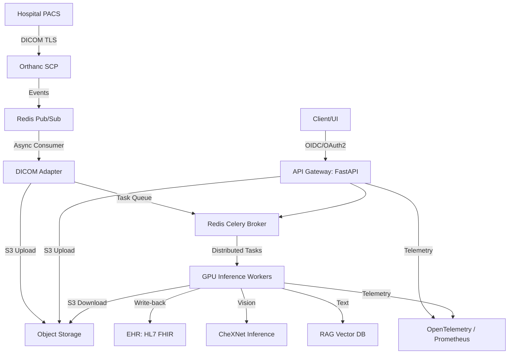

<div align="center">

# Clinica-LENS
### Longitudinal Explainable Network System for Multi-modal Clinical Diagnostics

[](https://www.python.org/downloads/)
[](https://pytorch.org/)
[](https://fastapi.tiangolo.com/)
[](https://www.docker.com/)
[](https://kubernetes.io/)
[](https://opensource.org/licenses/MIT)

<br>

[](https://github.com/dhruvin0041/Clinica-LENS)
[](https://github.com/dhruvin0041/Clinica-LENS)
[](https://github.com/dhruvin0041/Clinica-LENS)

</div>

---

## Executive Summary

**Clinica-LENS** is an enterprise-grade, cloud-native diagnostic platform designed for complex hospital environments. It integrates vision, text, and longitudinal patient data to provide explainable clinical insights. Built as a Software as a Medical Device (SaMD), the system bridges state-of-the-art multimodal AI with active medical infrastructure (PACS, FHIR) to support professional radiological workflows.

The architecture emphasizes distributed, stateless services, decoupled event-driven ingestion, and zero-trust security principles, making it suitable for scalable deployment in production healthcare settings.

---

## Key Features

### Clinical AI
- **Multi-modal Fusion:** Cross-attention transformer mechanisms integrating visual findings with patient history.
- **Vision Encoding:** DenseNet121-based CheXNet backbone for high-resolution medical image feature extraction.
- **Text Understanding:** SapBERT integration for processing clinical notes and medical terminology.
- **Temporal Analysis:** Siamese-based longitudinal scoring to track disease progression across current and prior studies.

### Medical Interoperability
- **Event-Driven PACS:** Asynchronous DICOM ingestion via Orthanc bridged with Redis Pub/Sub for scalable, non-blocking image processing.
- **DICOMweb Support:** Native WADO-RS and QIDO-RS compatibility for cloud-native imaging retrieval.
- **FHIR Synchronization:** Active write-back of AI-generated `DiagnosticReport` resources to hospital EHRs.

### Explainability
- **Spatial Localization:** Grad-CAM heatmaps for high-attribution feature region identification.
- **Counterfactual Reasoning:** Inpainting-based "what-if" analysis quantifying the diagnostic impact of specific visual regions.
- **Uncertainty Quantification:** Epistemic uncertainty estimation via Monte Carlo (MC) Dropout and clinical probability alignment using Platt Scaling and Conformal Prediction.

### Security
- **Identity & Access Management:** OIDC/OAuth2 authentication with multi-tenant isolation.
- **Zero-Trust Networking:** Implements mTLS across internal pod communication and DICOM TLS at the PACS edge.
- **Data Protection:** S3-compatible object storage with Server-Side Encryption (SSE) and strict secrets management via external operators.

### Scalability & Operations
- **Stateless Architecture:** Fully decoupled REST API and Celery workers utilizing shared object storage.
- **Infrastructure as Code:** Comprehensive AWS EKS deployment via Terraform.
- **Observability:** Distributed tracing and structured JSON logging via OpenTelemetry.

---

## Architecture Overview

Clinica-LENS follows a Distributed Clinical Mesh architecture, ensuring high availability, multi-tenant isolation, and fault tolerance.



Data flows asynchronously from ingress to inference. DICOM instances are securely stored in S3, while lightweight URIs are passed through the Redis task queue to GPU-accelerated Celery workers.

---

## Clinical AI Pipeline

1. **Pre-processing:** Supports high-bit depth DICOM images with dynamic windowing (Window Center/Width) to preserve clinical detail.
2. **Inference & Calibration:** Generates raw logits which are calibrated via Platt Scaling to ensure predicted confidence matches real-world clinical probabilities.
3. **Retrieval-Augmented Generation (RAG):** Verifies visual findings against established medical literature, generating structured radiology reports comprising "Findings" and "Impression."

---

## Technology Stack

| Category | Technologies |
|---|---|
| **Core Frameworks** | PyTorch, FastAPI, Celery |
| **Medical Imaging** | pydicom, pynetdicom, Orthanc |
| **NLP & RAG** | LangChain, HuggingFace Transformers, FAISS |
| **Infrastructure** | Docker, Kubernetes, Terraform, AWS EKS |
| **Data Storage** | Redis, S3 (MinIO/AWS) |
| **Observability** | OpenTelemetry, Prometheus, Grafana |

---

## Infrastructure and Deployment

The system provides robust infrastructure scaffolding for production environments:

- **Containerization:** Dockerfiles optimized for multi-stage builds.
- **Kubernetes Manifests:** Includes Deployments, Services, Ingress, Horizontal Pod Autoscalers (HPA), Pod Disruption Budgets (PDB), and NetworkPolicies.
- **Stateless Design:** Ephemeral API and worker nodes backing into persistent S3 object storage and Redis.

---

## Security and Compliance

Designed to support rigorous healthcare compliance standards:
- **Authentication:** Validates JWTs issued by federated OpenID Connect (OIDC) Identity Providers.
- **Role-Based Access Control (RBAC):** Extends Kubernetes RBAC for cluster administration and API role enforcement.
- **Audit Logging:** Structured JSON audit trails capturing tenant IDs and trace IDs for all API operations.
- **Regulatory Readiness:** Includes scaffolding for Clinical Evaluation Reports (CER) and ISO 14971 Risk Management tracking within the `regulatory/` directory.

---

## Explainability and Uncertainty Quantification

Clinica-LENS prioritizes clinical safety by implementing techniques to highlight *why* a model made a decision and *how confident* it is:
- **Grad-CAM:** Visually localizes predictive features.
- **Conformal Prediction:** Provides a statistically guaranteed set of possible diagnoses based on a configurable confidence threshold (e.g., 85%).
- **MC Dropout:** Quantifies model uncertainty, flagging edge-case images for human radiologist review.

---

## Repository Structure

```text
.
├── app/                  # Streamlit UI Dashboard
├── docs/                 # SRE, Disaster Recovery, and Security Runbooks
├── k8s/                  # Kubernetes production manifests (HPA, PDB, NetworkPolicies)
├── load_tests/           # Locust performance testing scripts
├── orthanc/              # DICOM Edge proxy configuration and event plugins
├── regulatory/           # Compliance frameworks (CER, Risk Management)
├── scripts/              # Utility and model export scripts
├── src/                  # Core Application Logic
│   ├── api.py            # FastAPI Gateway
│   ├── auth.py           # OIDC Integration
│   ├── pipeline.py       # Multi-modal AI Orchestration
│   ├── storage.py        # S3 Object Storage Backend
│   ├── worker.py         # Celery Async Tasks
│   └── xai.py            # Explainability Modules
├── terraform/            # AWS IaC (VPC, EKS, S3, ElastiCache)
├── tests/                # Unit and Integration test suites
└── docker-compose.yml    # Local development stack
```

---

## Getting Started

### Prerequisites
- Docker & Docker Compose
- Python 3.10+
- AWS CLI (for production deployment)
- Terraform (for infrastructure provisioning)

### Local Development Stack
Start the integrated local environment containing the API, UI, Orthanc, and Redis:
```bash
docker-compose up --build
```
Access the components:
- **UI:** `http://localhost:8501`
- **API Docs:** `http://localhost:8000/docs`
- **Orthanc DICOM SCP:** `localhost:4242`

---

## Configuration

The platform relies on environment variables for twelve-factor app configuration. Key variables include:
- `CELERY_BROKER_URL`: Redis connection string.
- `S3_ENDPOINT_URL`, `S3_BUCKET_NAME`: Object storage parameters.
- `JWT_SECRET_KEY`: Used for legacy/local testing prior to OIDC integration.
- `REDIS_HOST`, `REDIS_PORT`: Event adapter configuration.

---

## API Documentation

The FastAPI gateway automatically generates OpenAPI specifications. Once running, visit `/docs` for the interactive Swagger UI. Primary endpoints include:
- `POST /predict`: Submit DICOM files and clinical notes for asynchronous inference.
- `GET /status/{job_id}`: Poll Celery task completion status.
- `POST /fhir/DiagnosticReport`: Write-back endpoint for EHR integration.
- `GET /dicomweb/studies/{study_uid}`: WADO-RS stub for study metadata.

---

## Monitoring and Observability

Clinica-LENS is instrumented for deep operational visibility:
- **OpenTelemetry:** Propagates trace IDs across the FastAPI gateway and Celery workers.
- **Prometheus Metrics:** Exposes `api_requests_total` and `api_request_latency_seconds` at the `/metrics` endpoint.
- **Structured Logging:** Utilizes `python-json-logger` for ELK/Datadog compatible log aggregation.

---

## Testing

The repository contains a robust testing suite utilizing `pytest`.

```bash
# Run unit and integration tests with coverage
pytest tests/ --cov=src
```
Tests validate API endpoints, mock S3 integrations, and confirm correct PyTorch tensor shapes through the multimodal pipeline.

---

## Load Testing

Performance benchmarking is managed via Locust.

```bash
# Run headless load tests against the API
locust -f load_tests/locustfile.py --headless -u 100 -r 10 --run-time 1m
```

---

## Infrastructure as Code

Production deployment is managed via Terraform targeting AWS. The scaffolding provisions:
- A custom VPC with public and private subnets.
- An EKS cluster with GPU-accelerated managed node groups.
- AES256-encrypted S3 buckets.
- ElastiCache Redis clusters.

Deploy via:
```bash
cd terraform
terraform init
terraform plan
terraform apply
```

---

## Disaster Recovery and Runbooks

Operational procedures are documented in the `docs/` directory:
- **SRE Runbook:** Incident response guidelines for high latency, OOM events, and Orthanc queue backlogs.
- **Disaster Recovery:** RTO/RPO objectives, cross-region S3 replication strategies, and state retrieval procedures.
- **Security:** Hardening guidelines covering mTLS, RBAC, and Secret rotation.

---

## Roadmap

- Migration of `pynetdicom` synchronous calls to an entirely event-driven architecture.
- Implementation of a drift-detection pipeline for continuous MLOps calibration.
- Expansion of the Kubernetes manifest library to include Istio Service Mesh definitions.

---

## Contributing

We welcome contributions from the community. Please review our contribution guidelines before submitting pull requests. Ensure all code passes linting (`flake8`) and type checking (`mypy`) via the included GitHub Actions CI pipeline.

---

## License

This project is licensed under the MIT License - see the LICENSE file for details.

---

## Author

Developed and maintained by [dhruvin0041](https://github.com/dhruvin0041).